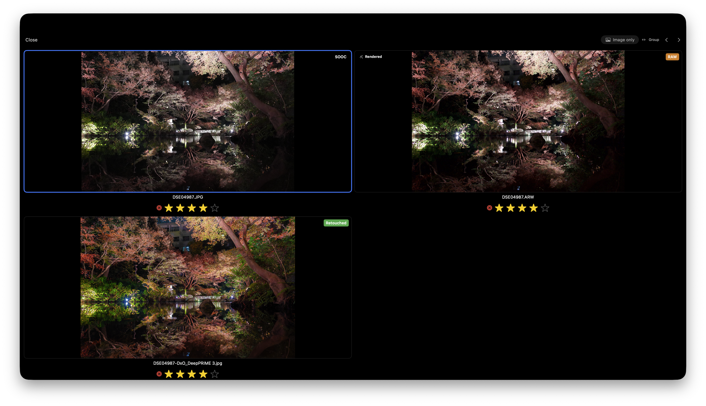

# Compare

bridge-lite treats the camera JPEG, RAW, and developed file from the same shutter press as **one group**. Each individual file within a group — the camera JPEG, the RAW, and the developed variant — is called a **member**.

## Why compare all three

Sometimes the camera's output is simply better. Sometimes heavy processing makes you lose track of the original. Switching between all three gives you a clear ground truth before you decide which to keep.

## Switching Photos

Arrow keys and `Ctrl + Tab` can be toggled between group-level and member-level navigation.

| Key | Default | After toggling [Group / Member] |
|-----|---------|-------------------------------|
| ← / → / ↑ / ↓ | Move between groups | Move between members |
| Ctrl + Tab / Ctrl + Shift + Tab | Move between members | Move between groups |

Clicking **[Group / Member]** at the top of the screen reverses these two behaviors.

## Image Only mode

Clicking **[Image Only]** excludes RAW files from the group, so you can compare the camera JPEG and developed file directly.

RAW previews are rendered on-the-fly by Apple's rendering engine and do not reflect the actual developed output. Excluding RAW lets you compare the images that will actually be exported, side by side.

## How pairing works

RAW and JPG files are automatically paired in this order:

1. **Stem name** — `DSC04867.ARW` and `DSC04867.JPG` share the same stem
2. **EXIF timestamp** — Files shot at the same time, even with different names
3. **pHash** — Perceptual hash for visual similarity

Files without EXIF data, or shots with very similar compositions, may be incorrectly paired.

## What counts as "developed"

A JPEG or TIFF exported from Lightroom (or any editor) with the same stem name in the same folder is automatically recognized as a developed variant.

Files without EXIF data, or shots with very similar compositions, may be incorrectly paired. In particular, if EXIF has been intentionally stripped before delivery, pairing relies on pHash alone, which increases the risk of mismatches between visually similar shots from different exposures.
