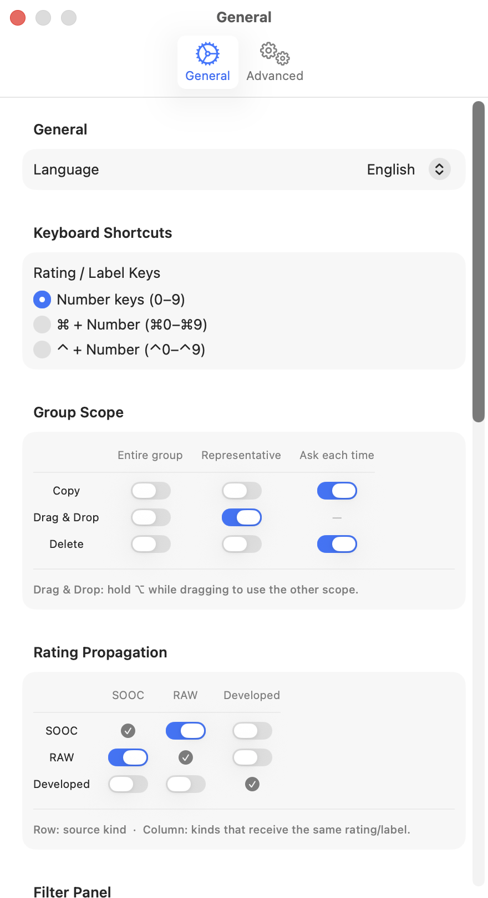
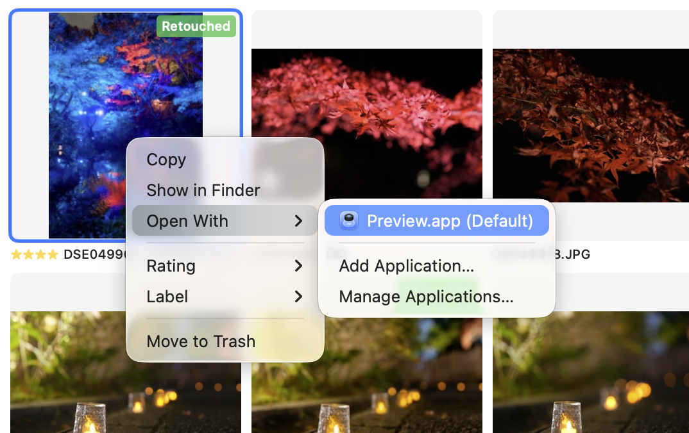

# Photo file operations

You can copy, drag and drop, or delete selected photos.

## Group scope

When photos are grouped, you can configure the scope of file operations in the **Group Scope** section of Settings.

| Operation | Scope options |
|---|---|
| Copy | Entire group / Representative only / Ask each time |
| Drag & Drop | Entire group / Representative only |
| Delete | Entire group / Representative only / Ask each time |

- **Entire group**: applies the operation to all photos in the group
- **Representative only**: applies the operation only to the representative shot
- **Ask each time**: shows a confirmation dialog each time to choose the scope

For Drag & Drop, hold `⌥` while dragging to temporarily switch to the other scope.

## Open with application

Right-clicking a photo and choosing **Open With** lets you open it in a specific application. Even when photos are grouped, only the representative shot is sent to the application.

