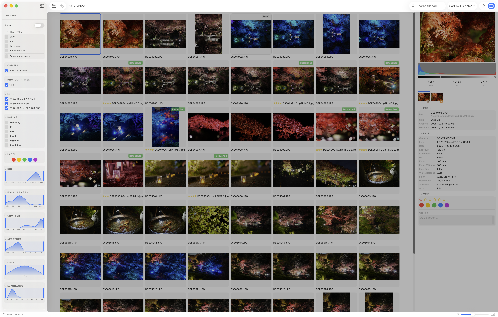

# Filters

The filters in the left sidebar let you narrow down the photos displayed in the grid. The toggle at the top of the panel also enables [flat view](./flat), which disables grouping entirely.

## FILE TYPE

A concept unique to bridge-lite, which is built around grouping. This filter controls which file type becomes the **representative photo** of each group.

| Type | Description |
|---|---|
| SOOC | In-camera JPEG (Straight Out Of Camera) |
| RAW | RAW file |
| Developed | JPEG / TIFF exported from Lightroom or similar |
| Indeterminate | Files that cannot be classified into any of the above |

Only checked types are shown as group representatives. When multiple types are checked, the priority order **Developed > SOOC > RAW** determines which type appears.

**Camera only** hides photos that have no EXIF data (e.g. screenshots).

### Example

Say you have 10 photos — 5 that look great straight out of camera, and 5 you want to develop. After importing the developed files into the folder, checking both **SOOC** and **Developed** lets you view all 10 photos at once: the developed version for those 5, and the SOOC for the rest.

## Metadata filters (checkboxes)

Filter by EXIF metadata attached to your photos.

| Filter | Description |
|---|---|
| Camera | Filter by camera model |
| Photographer | Filter by photographer |
| Lens | Filter by lens |
| Rating | Filter by star rating |
| Label | Filter by label |

## Metadata filters (histograms)

Filter by numeric ranges derived from EXIF metadata. Each filter displays a histogram of the distribution — useful not only for filtering but also for understanding your own shooting tendencies (e.g. which focal lengths you use most).

| Filter | Description |
|---|---|
| ISO | Filter by ISO value |
| Focal length | Filter by focal length |
| Shutter speed | Filter by shutter speed |
| Aperture | Filter by aperture (f-number) |
| Date & time | Filter by shooting date and time |
| Saturation | Filter by saturation |

## Other operations

### Collapsing filters

Click the arrow on the right side of any filter header to collapse or expand it. Folding away filters you don't need keeps the sidebar tidy.

### Reordering filters

You can change the order of filters in the Settings screen. Moving your most-used filters to the top makes them easier to reach.
