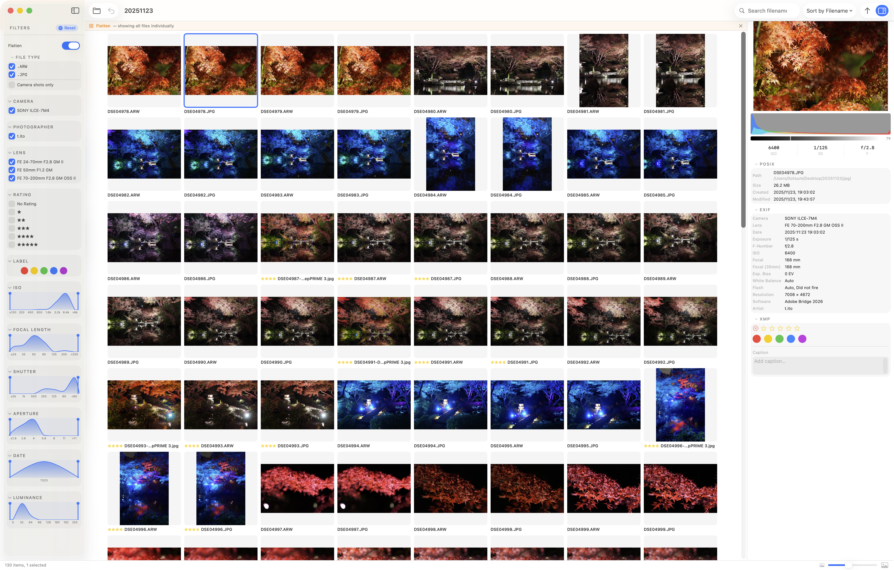

# Flat view

Turning on the toggle at the top of the filter panel switches to **flat view**, which disables grouping and shows every photo individually.

Normally, bridge-lite groups photos from the same scene (SOOC, RAW, and developed files) and shows only one representative per group. With flat view enabled, grouping is ignored and all files are listed side by side.

While flat view is active, the FILE TYPE filter behaves differently as well. Instead of filtering by type labels such as SOOC, RAW, or Developed, it filters by **file extension**.

## Example use cases

- Review all RAW files in a folder at once
- Browse only developed files
- See every file regardless of grouping state
