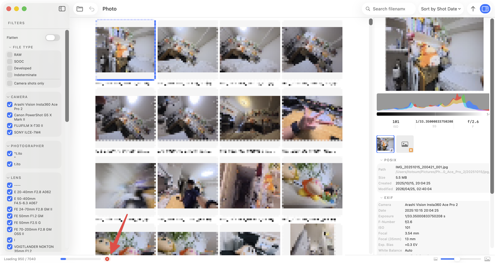

# Open a folder

## How to open

After launching, open a folder by either:

- Menu bar → **"Open Folder…"**
- **Drag and drop** a folder onto the bridge-lite window

## What happens on open

1. bridge-lite recursively scans the folder for image files
2. RAW and JPG files are automatically paired (stem name → EXIF timestamp → pHash)
3. Thumbnails are generated and cached

Subsequent opens use the cache and are significantly faster.

## Supported formats

| Category | Formats |
|---|---|
| JPEG | `.jpg` / `.jpeg` |
| RAW | `.arw` (Sony) / `.cr2` / `.cr3` (Canon) / `.nef` (Nikon) / `.raf` (Fujifilm) / `.orf` (Olympus) / `.pef` (Pentax) / `.dng` |
| Developed | JPEG or TIFF files linked by stem name to a RAW |

## Cancelling a scan

Folders with around 500 photos scan almost instantly. With 1,000 or more photos, the scan may take longer and the app may feel slower.

To cancel a scan, press the button in the bottom-left corner of the window.

The bottom-left area also shows a seekbar with two values:

- **Photos found** — total number of images discovered in the folder
- **Thumbnails loaded** — number of photos whose thumbnails have finished generating

## Opening from a memory card

Since BridgeLite never modifies files, it is safe to open folders directly from a mounted memory card or network drive.
