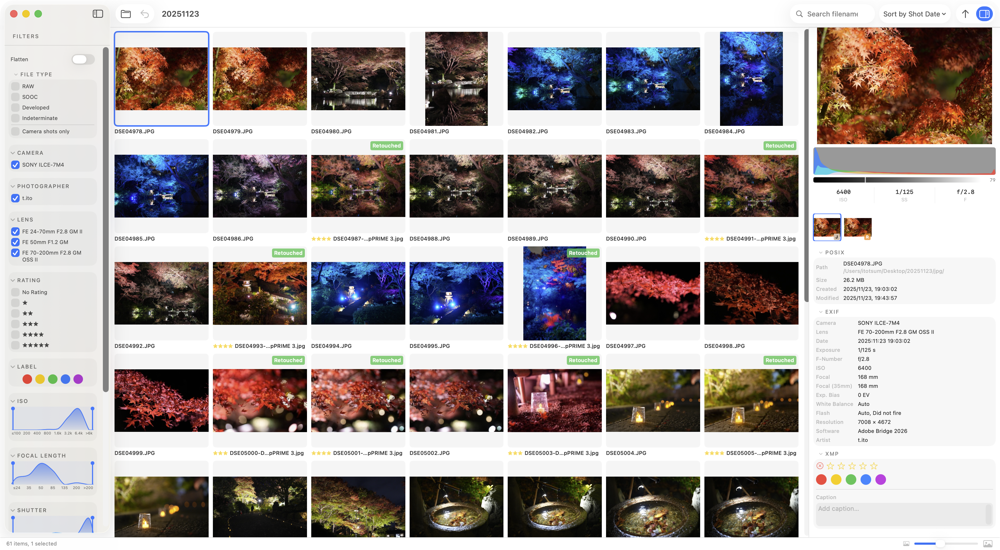

# Browse

The main working view. All photos in the folder are displayed as a scrollable grid.

## Layout

- **Left sidebar** — [Filters](./filter-spec) (file type, camera, ISO, focal length, date, rating, label, flag)
- **Center grid** — Thumbnail view
- **Metadata bar** — Preview, histogram, group members, and metadata (EXIF / XMP) for the selected photo

## Controls

| Action | Result |
|---|---|
| Click | Select a photo |
| Double-click | Open compare view |
| `←` / `→` / `↑` / `↓` | Move to previous / next photo |
| `Space` | Open / close full-res viewer |
| Scroll | Scroll the grid |

## Thumbnail badges

Each thumbnail shows a badge indicating its file type.

| Badge | Meaning |
|---|---|
| `SOOC` | Camera output (straight-out-of-camera JPEG) |
| `RAW` | RAW file |
| `Developed` | Developed variant |
| `Indeterminate` | File type could not be determined automatically |

See [Labeling](./labeling) for details.

## Thumbnail size

Use the slider in the top-right of the grid to adjust thumbnail size.
