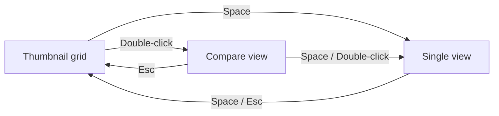

# UI Navigation

BridgeLite consists of three central views and two sidebars.

## Views

- **[Thumbnail grid](./thumbnail-grid)** — The main view, shown when a folder is opened
- **[Compare view](./compare)** — Shows camera JPEG, RAW, and developed variants side by side
- **[Single view](./viewer)** — Displays a single photo at full resolution

## Left sidebar (Filters)

A filter panel for narrowing down the photos shown. Supports filtering by file type, camera, ISO, focal length, date, rating, label, and more. See [Filters](./filter-spec) for details.

## Metadata bar

A panel showing information about the selected photo.

- **Group** — When the selected photo belongs to a group (e.g. a burst sequence), shows all shots in that group. Individual shots can be selected and rated from here
- **Metadata** — Shows capture information for the selected photo (camera, lens, ISO, shutter speed, aperture, etc.)

## How views connect

## Transition summary

| Transition | Action |
|---|---|
| Grid → Compare view | Double-click a thumbnail |
| Compare view → Grid | `Esc` |
| Compare view → Single view | `Space` or Double-click |
| Grid → Single view | `Space` |
| Single view → Grid | `Space` or `Esc` |
