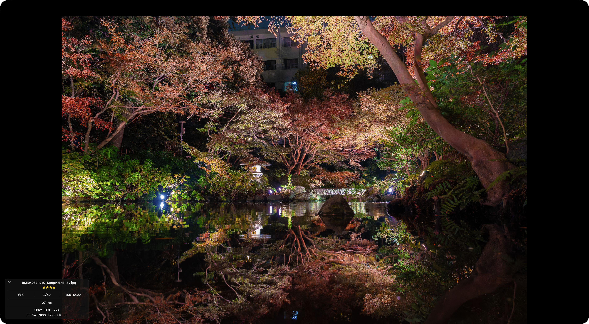

# Inspect

Press `Space` to open the selected photo at full resolution.

## Controls

| Key | Action |
|---|---|
| `Space` | Open / close viewer |
| `←` / `→` | Previous / next photo |
| `Tab` | Switch between camera JPEG, RAW, and developed |
| `0`–`5` | Star rating |
| `Esc` | Close viewer |
| `i` | Show / hide detail overlay |

## Detail overlay

Shooting information appears in the bottom-left of the viewer.

Moving the cursor to the top-right of the screen reveals the **[i]** button, which can also be clicked to toggle the overlay.

- Aperture (f-number)
- Shutter speed
- ISO
- Focal length
- Camera model
