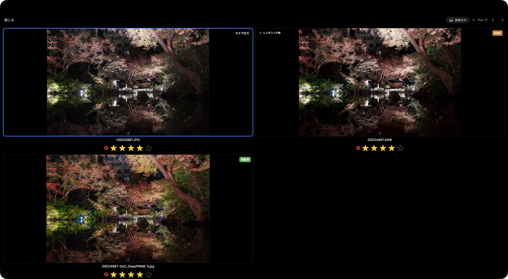

# 比較する

bridge-lite は「撮って出し（JPEG）」「RAW」「現像済み」を**1つのグループ**として扱います。グループを構成する個々のファイル——撮って出し・RAW・現像済みのそれぞれ——を**メンバー**と呼びます。

## なぜ三種を並べるのか

現像によって思い通りの色が出せることもあれば、カメラ出力の方が素直に良い場合もあります。また、現像を重ねるうちに元の色調を見失うこともあります。三つを行き来することで、判断の根拠を確かめながらセレクトができます。

## 写真の切り替え

矢印キーと `Ctrl + Tab` の動作は、グループ間・メンバー間で切り替えられます。

| 操作 | デフォルト | [グループ / メンバー] 押下後 |
|------|-----------|-------------------------------|
| ← / → / ↑ / ↓ | グループ間を移動 | メンバー間を移動 |
| Ctrl + Tab / Ctrl + Shift + Tab | メンバー間を移動 | グループ間を移動 |

画面上部の **[グループ / メンバー]** をクリックすると、この操作が逆になります。

## 画像のみモード

**[画像のみ]** をクリックすると、RAW ファイルをグループから除外し、撮って出し（JPEG）と現像済みだけを比較できます。

RAW の表示は Apple のレンダリングエンジンがその都度生成したプレビューであり、実際の現像結果とは異なります。RAW を除いて比較することで、実際に書き出される画像同士をより正確に見比べられます。

## ペアリングの仕組み

RAW と JPG の自動ペアリングは以下の順で行われます。

1. **ステム名** — `DSC04867.ARW` と `DSC04867.JPG` のようにファイル名（拡張子を除く部分）が一致するもの
2. **EXIF タイムスタンプ** — ステム名が異なっても撮影時刻が一致するもの
3. **pHash** — 知覚ハッシュによる視覚的類似度

EXIF 情報を持たないファイルや、構図が似通った別カットは誤認識する場合があります。

## 現像バリアントとは

Lightroom などで書き出した JPEG や TIFF が、同じステム名で同じフォルダに存在する場合、bridge-lite はそれを「現像済み」バリアントとして自動的に認識します。

EXIF 情報を持たないファイルや、構図が似通った別カットは誤認識する場合があります。特に、納品前に意図的に EXIF を削除している場合は pHash のみが頼りとなるため、類似した構図の別カットが誤ってグループ化される可能性があります。
