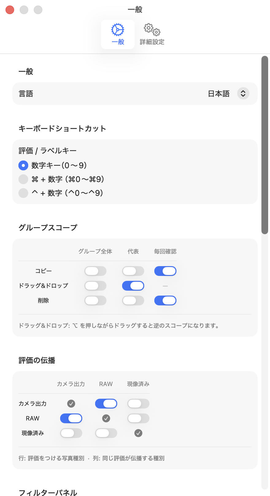
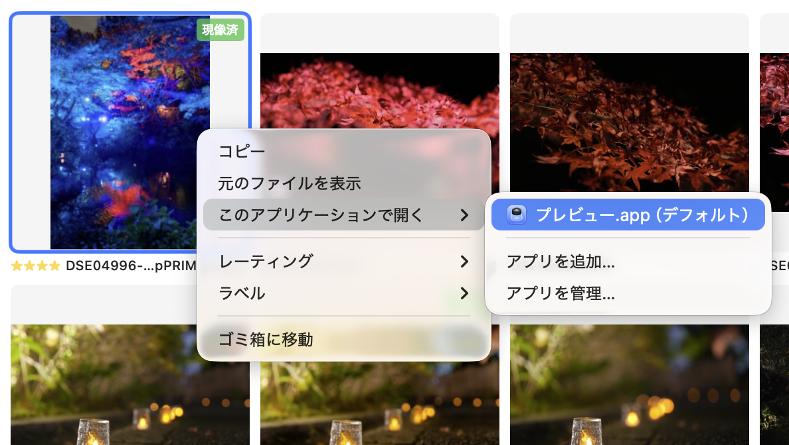

# 写真のファイル操作

選択した写真に対して、コピー・ドラッグ＆ドロップ・削除などのファイル操作が行えます。

## グループスコープ

写真がグループ化されている場合、ファイル操作の対象範囲（スコープ）を設定画面の **Group Scope** セクションで変更できます。

| 操作 | スコープの選択肢 |
|---|---|
| コピー | グループ全体 / 代表のみ / 毎回確認 |
| ドラッグ＆ドロップ | グループ全体 / 代表のみ |
| 削除 | グループ全体 / 代表のみ / 毎回確認 |

- **グループ全体**：グループに属するすべての写真を対象にする
- **代表のみ**：グループの代表カット 1 枚だけを対象にする
- **毎回確認**：操作のたびにどちらにするか確認ダイアログを表示する

ドラッグ＆ドロップは、ドラッグ中に `⌥` を押しながら操作すると、設定と逆のスコープに切り替えられます。

## アプリケーションで開く

写真を右クリックすると **Open With** から特定のアプリケーションで写真を開けます。グループ化されている場合も、対象は代表カットのみです。

