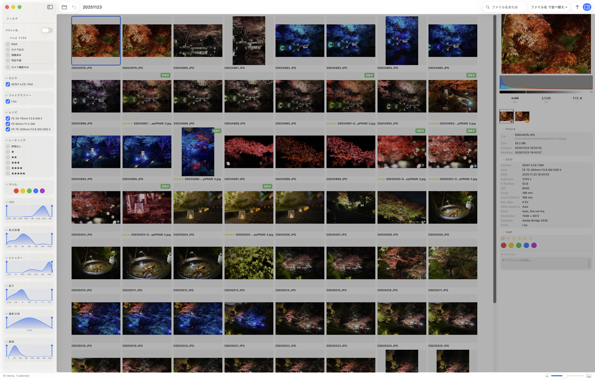

# フィルター

左サイドバーに表示されるフィルターを使用すると、表示する写真を絞り込むことができます。フィルターパネル上部のトグルでグループを解除する[フラット化](./flat)も利用できます。

## FILE TYPE（ファイル種別）

グルーピングを主機能とする bridge-lite 独自の概念です。各グループの「代表写真」を、ファイル種別によって切り替えます。

| 種別 | 説明 |
|---|---|
| カメラ出力 | カメラが生成した JPEG（SOOC） |
| RAW | RAW ファイル |
| 現像済み | Lightroom 等で現像した JPEG / TIFF |
| 判定不能 | 上記いずれにも分類できないファイル |

チェックを入れた種別のみがグループの代表として表示されます。複数チェックした場合は **現像済み > カメラ出力 > RAW** の優先順位で上位の種別が代表になります。

**カメラ撮影のみ** にチェックを入れると、EXIF 情報を持たない写真（スクリーンショット等）を除外します。

### 使用例

10 枚の写真があり、カメラ出力で満足できるものが 5 枚、現像したいものが 5 枚あったとします。Lightroom 等で現像したファイルをフォルダに取り込んだあと、「カメラ出力」と「現像済み」の両方にチェックを入れると、現像済みのものはそちらを、残りはカメラ出力を代表として 10 枚を一覧できます。

## メタデータによる絞り込み（チェックボックス）

取り込んだ写真の EXIF 情報をもとに絞り込みます。

| 項目 | 説明 |
|---|---|
| カメラ | 使用したカメラ機種で絞り込む |
| フォトグラファー | 撮影者で絞り込む |
| レンズ | 使用したレンズで絞り込む |
| 評価 | 星評価で絞り込む |
| ラベル | ラベルで絞り込む |

## メタデータによる絞り込み（ヒストグラム）

取り込んだ写真の EXIF 情報をもとに、数値範囲で絞り込みます。分布がヒストグラムで表示されるため、どの焦点距離をよく使うかなど撮影傾向の把握にも活用できます。

| 項目 | 説明 |
|---|---|
| ISO | ISO 感度で絞り込む |
| 焦点距離 | 焦点距離で絞り込む |
| シャッター | シャッタースピードで絞り込む |
| 絞り | 絞り値（F 値）で絞り込む |
| 撮影日時 | 撮影日時で絞り込む |
| 彩度 | 彩度で絞り込む |

## その他の操作

### フィルターの折りたたみ

各フィルターのタイトル右側にある矢印をクリックすると、そのフィルターを折りたたんだり展開したりできます。使用しないフィルターを畳んでおくと、サイドバーをすっきり使えます。

### フィルターの並び順の変更

設定画面でフィルターの表示順を入れ替えられます。よく使うフィルターを上に移動しておくと便利です。
