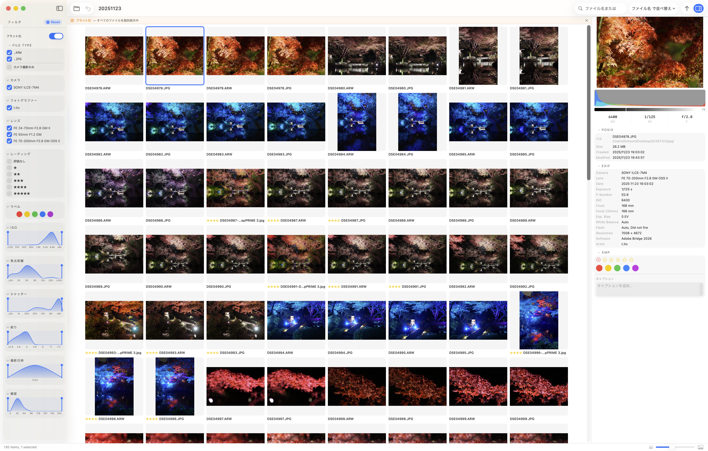

# フラット化

フィルターパネル上部のトグルをオンにすると、グループを解除してすべての写真を個別に表示する**フラット化**モードになります。

通常、bridge-lite は同じ撮影シーンの写真（カメラ出力・RAW・現像済み）をグループ化して代表の 1 枚だけを表示します。フラット化をオンにすると、グループを無視してすべてのファイルを個別に並べて表示します。

フラット化が有効な間は、FILE TYPE フィルターの動作も変わります。カメラ出力・RAW・現像済みといった種別ラベルではなく、**拡張子**によるフィルタリングになります。

## 使用例

- フォルダ内の RAW ファイルをまとめて確認したい
- 現像済みファイルだけを一覧したい
- グループ化の状態に関わらず全ファイルを把握したい
