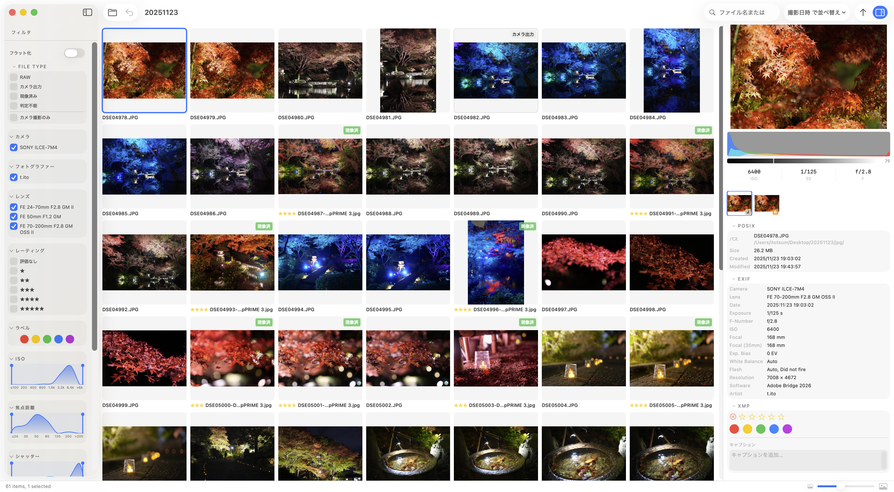

# 閲覧する

メインの作業画面です。フォルダ内の写真がグリッド状に並びます。

## 画面構成

- **左サイドバー** — [フィルター](./filter-spec)（ファイル種別・カメラ・ISO・焦点距離・日付・評価・ラベル・フラグ）
- **中央グリッド** — サムネイル一覧
- **メタデータバー** — 選択中の写真の EXIF・ヒストグラム・評価

## 操作

| 操作 | 動作 |
|---|---|
| クリック | 写真を選択 |
| ダブルクリック | 比較画面を開く |
| `←` / `→` / `↑` / `↓` | 前後の写真に移動 |
| `Space` | 単体ビューを開く / 閉じる |
| スクロール | グリッドをスクロール |

## サムネイルのバッジ

各サムネイルには種別を示すバッジが表示されます。

| バッジ | 意味 |
|---|---|
| `SOOC` | カメラ出力（撮って出し JPEG） |
| `RAW` | RAW ファイル |
| `現像済み` | 現像済みバリアント |
| `判定不能` | 種別を自動判定できなかったファイル |

詳細は[ラベリング](./labeling)を参照してください。

## サムネイルサイズの変更

グリッド右上のスライダーでサムネイルのサイズを変更できます。
