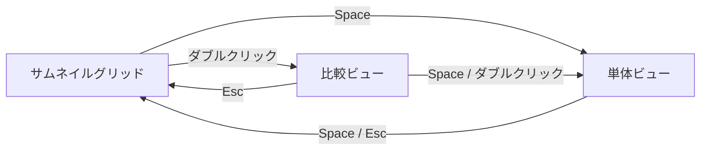

# UI 遷移

BridgeLite の画面は、中央の3つのビューと、左右のサイドバーで構成されています。

## ビュー

- **[サムネイルグリッド](./thumbnail-grid)** — メイン画面。フォルダを開くと最初に表示される
- **[比較ビュー](./compare)** — 撮って出し・RAW・現像済みを並べて確認する画面
- **[単体ビュー](./viewer)** — 1枚の写真をフル解像度で表示する画面

## 左サイドバー（フィルター）

表示する写真を絞り込むフィルターパネルです。ファイル種別・カメラ・ISO・焦点距離・日付・評価・ラベルなどの条件で絞り込めます。詳細は[フィルター](./filter-spec)を参照してください。

## メタデータバー

選択中の写真に関する情報を表示するパネルです。

- **グループ** — バースト撮影などでグループ化された写真の場合、グループ内のカット一覧を表示します。個別カットの選択や評価もここから行えます
- **メタデータ** — 選択中の写真の撮影情報（カメラ・レンズ・ISO・シャッタースピード・絞りなど）を表示します

## 遷移の関係

## 各遷移の操作まとめ

| 遷移 | 操作 |
|---|---|
| グリッド → 比較ビュー | サムネイルをダブルクリック |
| 比較ビュー → グリッド | `Esc` |
| 比較ビュー → 単体ビュー | `Space` または ダブルクリック |
| グリッド → 単体ビュー | `Space` |
| 単体ビュー → グリッド | `Space` または `Esc` |
