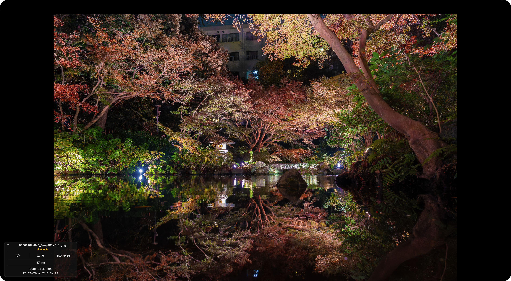

# 詳しく見る

`Space` キーで選択中の写真をフルスクリーンで表示します。

## 操作

| キー | 動作 |
|---|---|
| `Space` | ビューアを開く / 閉じる |
| `←` / `→` | 前後の写真に移動 |
| `Tab` | 撮って出し・RAW・現像済みを切り替え |
| `0`〜`5` | 星評価 |
| `Esc` | ビューアを閉じる |
| `i` | 詳細情報の表示／非表示 |

## 詳細情報表示

ビューア左下に撮影情報が表示されます。

カーソルを画面右上に移動すると **[i]** ボタンが現れます。クリックすることでも表示／非表示を切り替えられます。

- F 値
- シャッタースピード
- ISO
- 焦点距離
- カメラ機種
